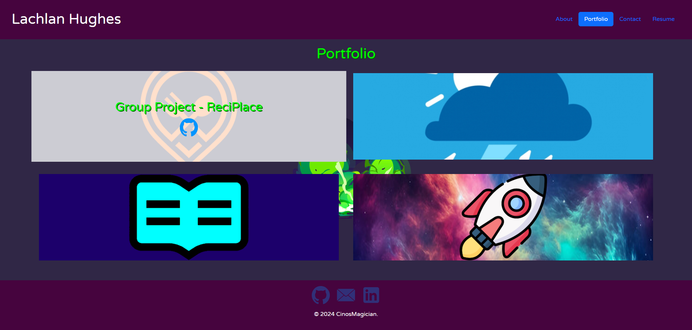

# Lachlan Hughes - Portfolio

## Description

This is an updated portfolio, but this time using reactJs to make a more dynamic and modular portfolio

## Table of Contents
- [Usage](#usage-info)
- [Questions](#questions)
- [Live Page](#live-page)
    
## Usage Info

Clicking on the buttons in the NavBar will take you to each section of the Portfolio page. About is the default page and will tell you a bit about myself. Portfolio shares some of the works I have created/worked on. Contact allows you to put your name, email and contact message in, which will be sent as an email notification to me. Resume has a list of my skills, education and work histroy. Down the bottom at the footer there are 3 buttons. The first will take you to my GitHub page. The second will take you to the contact tab, and the third will take you to linkedin (Currently not created but will be updated in the near future).
    
## Live Page
Screenshot:

Page Link:
https://main--lachlan-hughes-portfolio.netlify.app/

## Questions

If you wish to see any of my other works,
here is a link to my GitHub Page: [CinosMagician](https://github.com/CinosMagician)

If you wish to contact me directly, please email me: lachyhughes@bigpond.com
